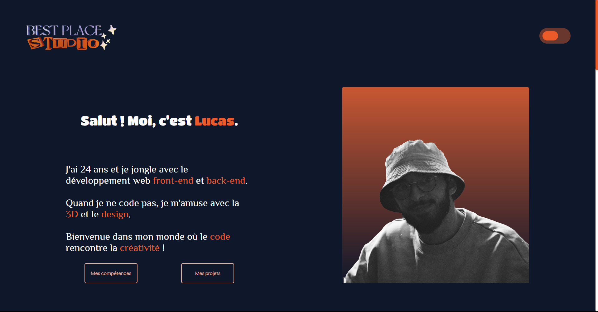
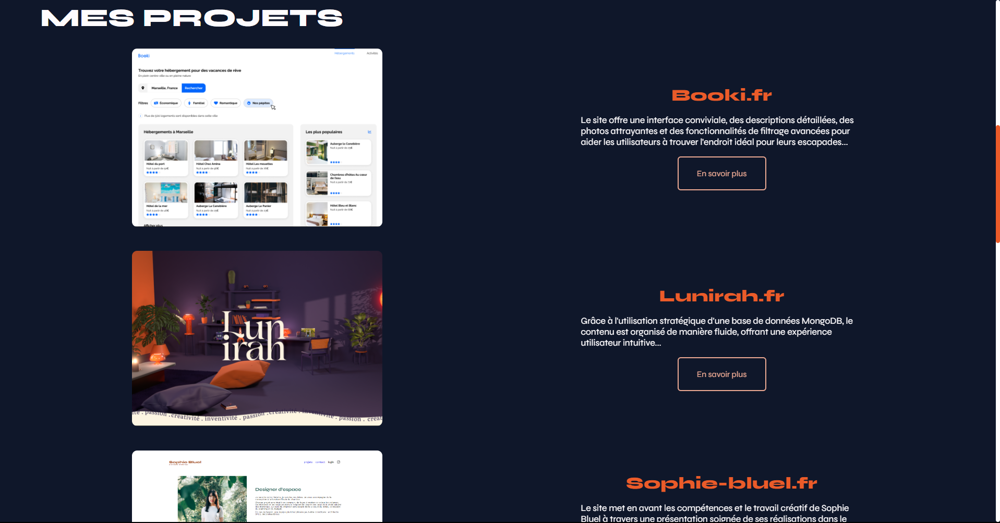

# Portfolio - Best Place Studio

Bienvenue dans le README de mon portfolio en ligne, accessible à l'adresse [portfolio.bestplacestudio.fr](https://portfolio.bestplacestudio.fr). Ce site est conçu pour présenter mon parcours, mes projets et mes compétences en tant que développeur. J'ai créé ce portfolio en utilisant React et SASS pour mettre en valeur mon travail et mes aspirations professionnelles.

## Aperçu

Le portfolio "Best Place Studio" est une vitrine numérique de mon parcours en tant que développeur. Vous y trouverez des informations sur mes projets passés, mes compétences techniques et mes compétences personnelles. J'ai choisi de développer ce site pour partager mon travail avec le monde, tout en mettant en évidence ma passion pour la création et la technologie.

## Projets

Le portfolio présente une sélection de projets que j'ai réalisés au cours de ma formation en développement. Chacun de ces projets reflète mon apprentissage et ma progression en tant que développeur. Vous pourrez y trouver des détails sur les objectifs, les technologies utilisées et les résultats obtenus pour chaque projet.

## Compétences Techniques

Je suis compétent dans un certain nombre de technologies et de langages de programmation, notamment :

- HTML5, CSS3, JavaScript
- React.js pour la création d'interfaces utilisateur interactives
- Utilisation de SASS pour des styles CSS avancés
- Gestion de versions avec Git et GitHub
- Conception réactive pour des sites adaptés à tous les appareils

## Compétences Personnelles

En plus de mes compétences techniques, je mets en avant mes compétences personnelles et soft skills :

- Collaboration efficace au sein d'équipes multidisciplinaires
- Capacité à communiquer des concepts techniques de manière claire et accessible
- Résolution de problèmes et débogage
- Apprentissage rapide et désir constant d'acquérir de nouvelles compétences

## Instructions d'Installation

1. Clonez ce dépôt sur votre machine locale.
2. Naviguez vers le dossier du projet.
3. Exécutez `npm install` pour installer les dépendances.
4. Utilisez `npm start` pour lancer l'application en mode de développement.

## Capture d'Écran

Ce portfolio est le résultat de mon engagement envers l'apprentissage et le développement continu. J'espère qu'il reflète mon dévouement envers l'excellence technique et mon enthousiasme pour la création. Je suis ouvert à toute opportunité de collaboration et de développement professionnel.

Pour toute question ou opportunité de collaboration, n'hésitez pas à me contacter.

=======
---

Ce portfolio est le résultat de mon engagement envers l'apprentissage et le développement continu. J'espère qu'il reflète mon dévouement envers l'excellence technique et mon enthousiasme pour la création. Je suis ouvert à toute opportunité de collaboration et de développement professionnel.

Pour toute question ou opportunité de collaboration, n'hésitez pas à me contacter.

**Développeur et Concepteur:** Lucas O
**Site Web:** [portfolio.bestplacestudio.fr](https://portfolio.bestplacestudio.fr)
**Date:** Août 2023
